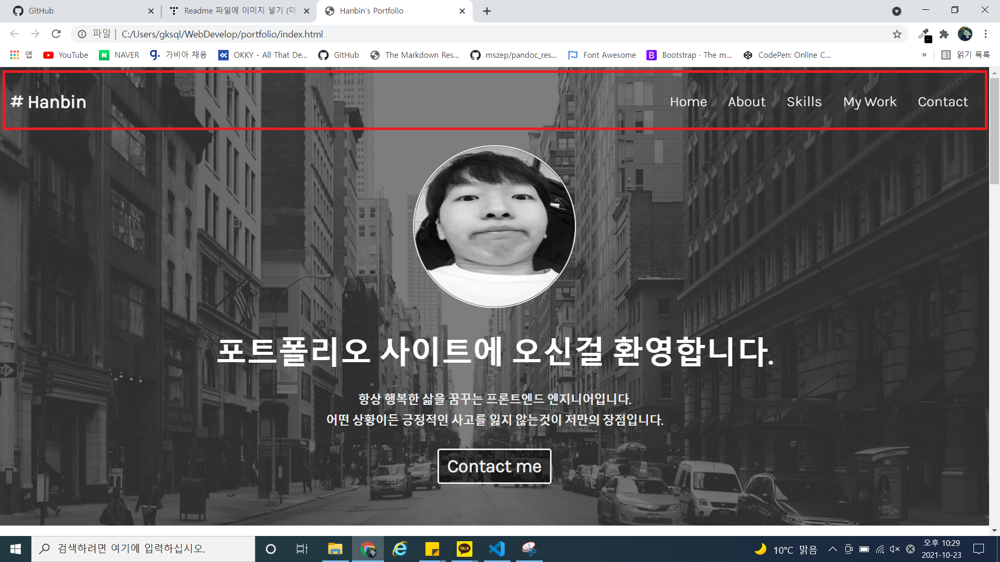
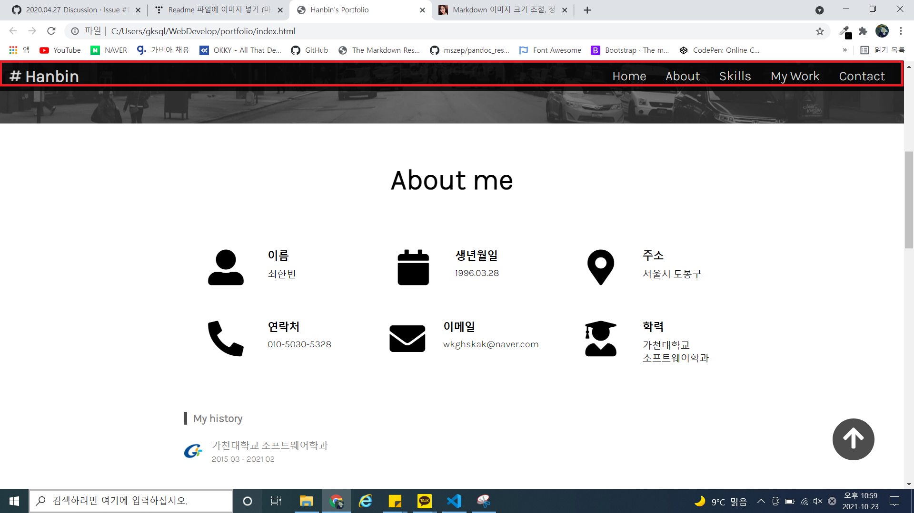
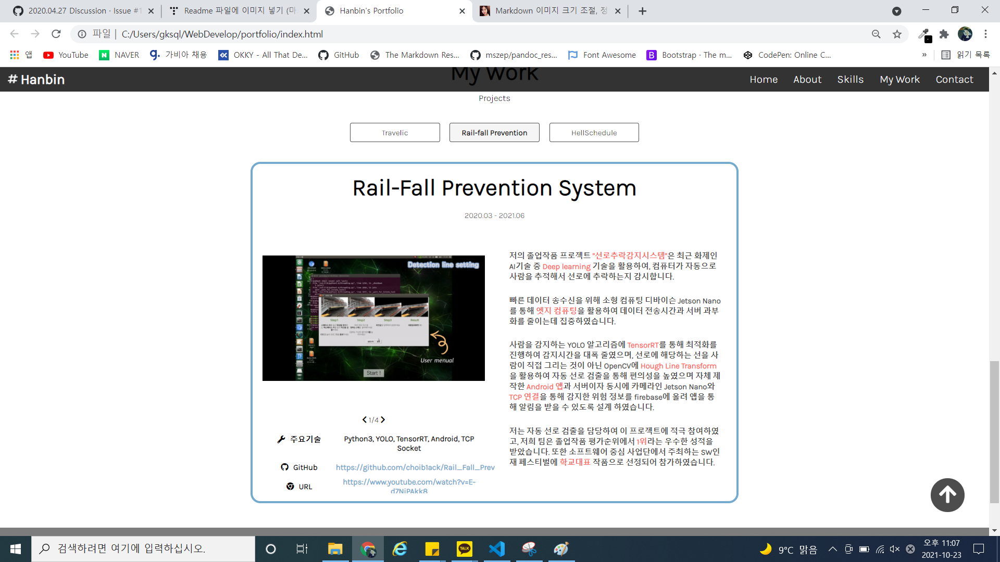
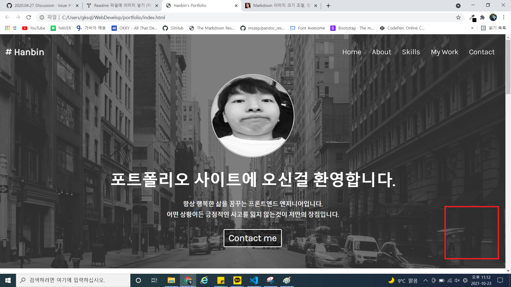
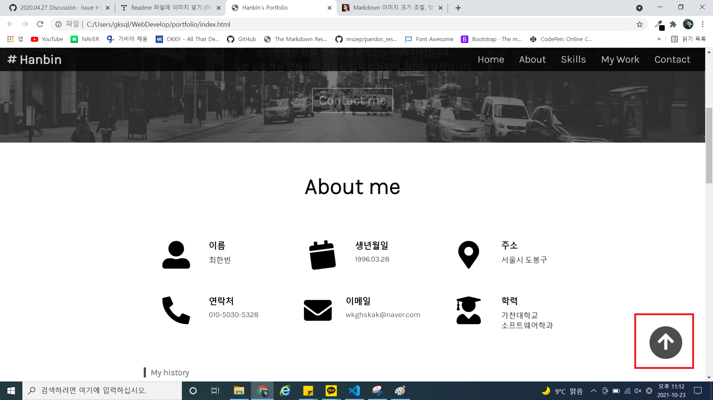
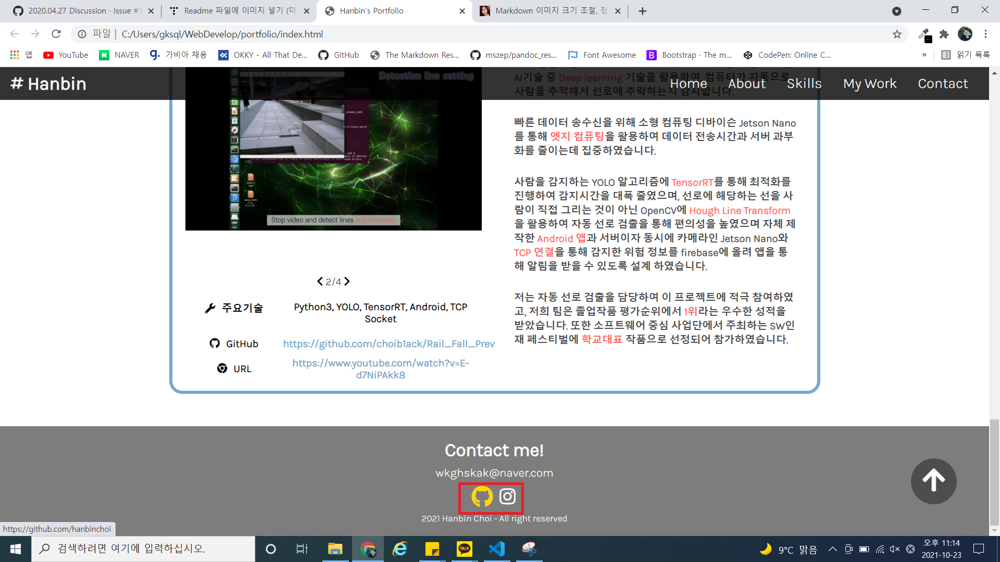

# 🎈 Welcome to my Portfolio! 🎈

### (URL)[https://hanbinchoi.github.io/portfolio/]

### 포트폴리오 웹 사이트 입니다

HTML, CSS, JavaScript로 동작하며,
데스크탑과 모바일 2가지에 반응형 디자인을 지원합니다

### Desktop

### Mobile

 
 

모바일 모드에서는 menu-bar는 숨겨지며 toggle 버튼을 통해 동작이 가능합니다.

 
 

메뉴 버튼을 통해 해당 메뉴로 이동할 수 있으며 메뉴 바 는 스크롤과 함께 내려옵니다.

 
 

---

프로젝트 화면은 3가지 프로젝트로 구성되어 있으며 버튼을 통해 원하는 프로젝트에 대한 설명을 볼 수 있습니다.

또한 이미지 선택 화살표는 현재 보고 있는 이미지에 맞춰 활성화되며 화살표 버튼을 통해 이미지를 전환할 수 있습니다.

 
 

페이지 상단으로 이동하고 싶으면 "위쪽 화살표" 버튼을 클릭하여 이동할 수 있으며 현재 스크롤 위치가 페이지 상단에 위치에 있을경우 버튼은 자동으로 숨겨집니다.

 
 

**홈 화면에 Contact 버튼은 Contact 메뉴로 이동 시킵니다. 또한 홈 화면은 스크롤이 내려지면서 투명도가 올라가며 자연스럽게 사라집니다.**

---

Contact me에 GitHub, Instagram 로고 를 클릭하면 저의 프로필 화면으로 이동합니다.

